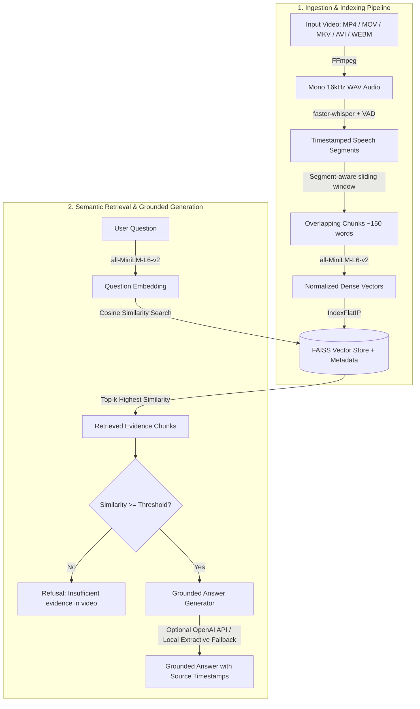

# Mini Video RAG

> **Grounded Video Question Answering via Speech Transcription & Semantic Vector Search**

Mini Video RAG is a lightweight, local Retrieval-Augmented Generation (RAG) system designed to make single 5–10 minute videos fully searchable. It converts spoken audio into timestamped speech segments, groups them into overlapping contextual chunks, embeds them into dense vector representations, and indexes them with FAISS. When a question is asked, the system retrieves the top-$k$ most semantically relevant moments and generates a strictly grounded answer with precise source timestamp citations.

The project works completely **offline by default** with a local extractive fallback, and optionally supports OpenAI LLMs for natural language synthesis.

---

## Architecture & Data Flow



---

## Key Features

- **End-to-End Local Pipeline**: Works out-of-the-box on CPU without mandatory third-party API keys or external subscriptions.
- **Accurate Speech-to-Text**: Employs `faster-whisper` (CTranslate2 backend) with integrated Voice Activity Detection (VAD) and automatic language detection.
- **Segment-Aware Timestamp Chunking**: Groups adjacent speech segments into ~150-word chunks with sliding overlap while preserving original utterance boundaries.
- **Semantic Vector Indexing**: Uses `sentence-transformers/all-MiniLM-L6-v2` with $L_2$-normalized embeddings and FAISS `IndexFlatIP` for cosine similarity matching.
- **Grounded & Hallucination-Resistant**: Responses are strictly constrained to retrieved transcript segments. If similarity scores fall below the configurable threshold, the system explicitly refuses to answer.
- **Modern Streamlit Dashboard**: Includes real-time pipeline status, progress indicators, cosine similarity score bars, collapsible full-transcript explorer, and adjustable runtime parameters.
- **Synthetic Test Generator**: Includes a built-in generator script (`generate_sample_video.py`) to create sample speech videos for rapid testing.

---

## Project Structure

```text
mini-video-rag/
├── app.py                      # Streamlit interactive web dashboard
├── generate_sample_video.py    # Test video generator with synthesized speech
├── requirements.txt            # Python dependencies
├── .env.example                # Environment configuration template
├── .env                        # Local environment variables (git-ignored)
├── README.md                   # Project documentation
├── src/
│   ├── __init__.py             # Package marker
│   ├── transcription.py        # FFmpeg audio extraction & faster-whisper transcription
│   ├── chunking.py             # Timestamp-preserving overlapping text chunking
│   ├── embeddings.py           # Lazy-loaded SentenceTransformer embedding wrapper
│   ├── retrieval.py            # FAISS IndexFlatIP store & top-k similarity search
│   ├── generation.py           # Grounded answer generation (OpenAI / extractive fallback)
│   └── utils.py                # Directory setup and timestamp formatting helpers
├── data/                       # Local data storage (git-ignored)
│   ├── videos/                 # Uploaded video files and extracted WAV audio
│   ├── transcripts/            # Raw Whisper JSON transcripts with timestamps
│   └── chunks/                 # Processed JSON chunk files
└── vectorstore/                # FAISS vector indices and chunk mappings (git-ignored)
```

---

## Prerequisites

- **Python**: Version `3.10` or higher.
- **FFmpeg**:
  - The application automatically detects system `ffmpeg` on PATH.
  - If system FFmpeg is not installed, the bundled `imageio-ffmpeg` package will automatically supply a compatible binary.

---

## Installation & Setup

### 1. Clone or Open the Repository

```bash
cd mini-video-rag
```

### 2. Create and Activate a Virtual Environment

**On Windows (PowerShell):**
```powershell
python -m venv .venv
.\.venv\Scripts\Activate.ps1
```

**On macOS / Linux:**
```bash
python3 -m venv .venv
source .venv/bin/activate
```

### 3. Install Dependencies

```bash
python -m pip install --upgrade pip
pip install -r requirements.txt
```

### 4. Configure Environment Variables (Optional)

Copy `.env.example` to create your local `.env` file:

**Windows (PowerShell):**
```powershell
Copy-Item .env.example .env
```

**macOS / Linux:**
```bash
cp .env.example .env
```

Edit `.env` to configure optional settings:

```env
# Optional: Enables natural language answer synthesis via OpenAI
OPENAI_API_KEY=your_openai_api_key_here
OPENAI_MODEL=gpt-4o-mini

# Optional: Local model configurations
WHISPER_MODEL=small
EMBEDDING_MODEL=sentence-transformers/all-MiniLM-L6-v2
```

> **Note**: An OpenAI API key is **not required**. Without a key, the system uses an extractive fallback that returns the exact verbatim transcript passage matching the question.

---

## Quickstart: Generate a Sample Video

If you do not have a video on hand, run the included sample generator script:

```bash
python generate_sample_video.py
```

This creates `data/videos/sample_lecture.mp4` containing synthesized speech on AI and RAG topics, ready for immediate testing.

---

## Running the Application

Launch the Streamlit dashboard:

```bash
streamlit run app.py
```

Once started, open your browser at `http://localhost:8501`.

---

## How to Use the App

1. **Upload Video**: Select a video (`.mp4`, `.mov`, `.mkv`, `.avi`, `.webm`), ideally 5–10 minutes long.
2. **Build Retrieval Index**: Click **Build index →**. The app extracts audio, runs Whisper speech recognition, builds text chunks, computes dense embeddings, and stores the FAISS index.
3. **Inspect Transcripts & Metrics**: Review the total indexed chunks, language detection output, and expand the **Source transcript** section to browse timestamped speech segments.
4. **Ask Questions**: Type a question regarding the video content (e.g., *"What problem does this method solve?"*).
5. **Adjust Parameters**:
   - **Top-k Slider**: Select how many chunks to retrieve (default: `3`).
   - **Similarity Threshold** (Sidebar): Adjust the cutoff score (default: `0.30`) below which the system refuses unsupported queries.
6. **Review Grounded Evidence**: Inspect the retrieved chunks ranked by cosine similarity, visual similarity progress bars, and the grounded response with timestamp citations.

---

## How Each Component Works

### 1. Audio Extraction & Transcription (`src/transcription.py`)
- Extracts a single-channel 16 kHz WAV audio stream using FFmpeg.
- Runs `faster-whisper` with Voice Activity Detection (`vad_filter=True`) to suppress silent segments.
- Formats every segment with start/end float seconds and formatted `HH:MM:SS` display timestamps.

### 2. Timestamped Chunking (`src/chunking.py`)
- Accumulates consecutive speech segments until reaching approximately 150 words.
- Preserves segment integrity without splitting individual speech segments across chunks.
- Applies a 1-segment sliding overlap to maintain conversational context across chunk boundaries.

### 3. Sentence Embeddings (`src/embeddings.py`)
- Uses `sentence-transformers/all-MiniLM-L6-v2` to map chunks and user questions into 384-dimensional dense vectors.
- Embeddings are $L_2$-normalized so that inner product calculations represent exact cosine similarities.

### 4. Vector Storage & Semantic Retrieval (`src/retrieval.py`)
- Initializes an in-memory FAISS `IndexFlatIP` index.
- Encodes incoming user questions and performs vector search against chunk embeddings.
- Returns the top-$k$ closest chunks ranked by similarity score.

### 5. Grounded Generation (`src/generation.py`)
- Enforces strict grounding: only the top-$k$ retrieved chunks are provided as context.
- **With `OPENAI_API_KEY`**: Prompts the LLM with `temperature=0` and a system guardrail prohibiting speculation outside the transcript context.
- **Without API Key (Fallback)**: Extracts and formats the highest-scoring passage with its timestamp range.
- **Guardrail**: If the top similarity score is below the threshold or evidence is insufficient, returns an explicit refusal:
  > *"I could not find enough information about this in the video."*

---

## Configuration Reference

| Variable | Default Value | Description |
|---|---|---|
| `OPENAI_API_KEY` | *(Empty)* | Optional OpenAI API key for LLM-based answer generation. |
| `OPENAI_MODEL` | `gpt-4o-mini` | OpenAI model identifier used for generation. |
| `WHISPER_MODEL` | `small` | Faster-Whisper model size (`tiny`, `base`, `small`, `medium`, `large-v3`). |
| `EMBEDDING_MODEL` | `sentence-transformers/all-MiniLM-L6-v2` | Hugging Face embedding model path or identifier. |

---

## Evaluation Methodology

To evaluate retrieval and grounding performance for academic or benchmark purposes:

1. **Test Dataset**: Prepare 5–10 representative questions with known answer timestamps in the video.
2. **Metrics**:
   - **Recall@k**: Percentage of questions where the ground-truth video timestamp is present within the top-$k$ retrieved chunks.
   - **Top-1 Accuracy**: Proportion of questions where the highest-ranked chunk directly answers the query.
   - **Cosine Similarity Distribution**: Comparison of similarity scores for relevant queries versus out-of-domain queries.

### Sample Evaluation Table

| Question | Ground Truth Timestamp | Top-1 Retrieved Timestamp | Top-3 Contains Answer? | Top-1 Similarity | Grounded Correctly? |
|---|---|---|---|---|---|
| *What is the main topic?* | `00:00:15` | `00:00:14 - 00:00:48` | Yes | 0.742 | Yes |
| *How does FAISS work?* | `00:02:10` | `00:02:05 - 00:02:40` | Yes | 0.685 | Yes |
| *What is quantum computing?* | *(Not in video)* | `00:01:20 - 00:01:50` | No | 0.184 | Refused (Passed) |

---

## Viva / Academic Presentation Guide

| Concept | Explanation |
|---|---|
| **What is RAG?** | Retrieval-Augmented Generation enhances generative AI by retrieving factual context from an external data source (e.g. video transcripts) before generating an answer. |
| **Why use dense embeddings over keyword search (BM25)?** | Embeddings capture semantic meaning and intent, allowing queries to match relevant video moments even if they do not share identical vocabulary. |
| **Why normalize vectors for FAISS `IndexFlatIP`?** | For unit vectors, the inner product $\mathbf{u} \cdot \mathbf{v}$ is mathematically identical to cosine similarity: $\frac{\mathbf{u} \cdot \mathbf{v}}{\|\mathbf{u}\|\|\mathbf{v}\|}$, eliminating the need for expensive division during search. |
| **Why store timestamps in chunks?** | Timestamps provide verifiability and auditability, allowing users to jump directly to the video timestamp where the statement was made. |
| **How is hallucination prevented?** | By strictly limiting the LLM context to retrieved chunks, enforcing a zero-temperature prompt, and refusing to answer when similarity scores fall below the threshold. |

---

## Troubleshooting

- **`RuntimeError: FFmpeg is unavailable`**:
  Ensure `imageio-ffmpeg` is installed (`pip install imageio-ffmpeg`) or install system FFmpeg and verify with `ffmpeg -version`.
- **First run is slow**:
  The first execution downloads Whisper and SentenceTransformer models locally. Subsequent runs use cached weights.
- **Language Warning**:
  The default `all-MiniLM-L6-v2` embedding model is optimized for English. For multilingual videos, set `EMBEDDING_MODEL=sentence-transformers/paraphrase-multilingual-MiniLM-L12-v2` in `.env`.
- **No speech segments found**:
  Verify the video has an audible voice track. Audio tracks with heavy background noise or music only may be filtered out by VAD.

---

## License

This project is open-source and intended for academic, research, and demonstration purposes.
